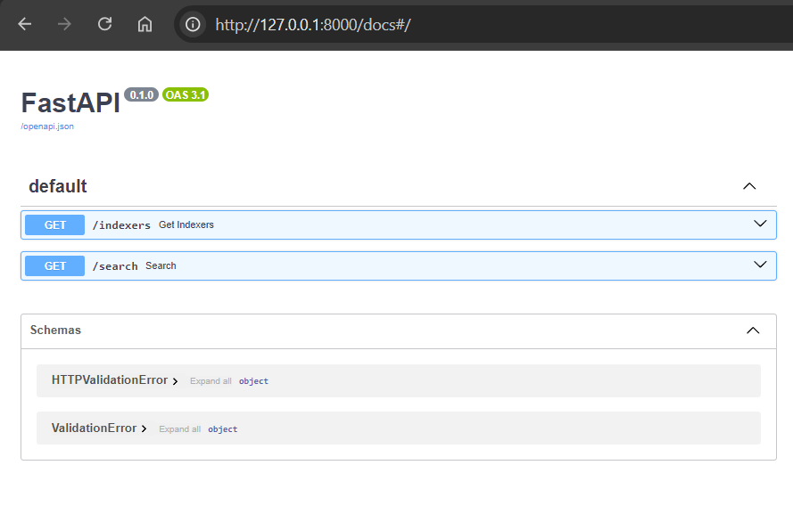
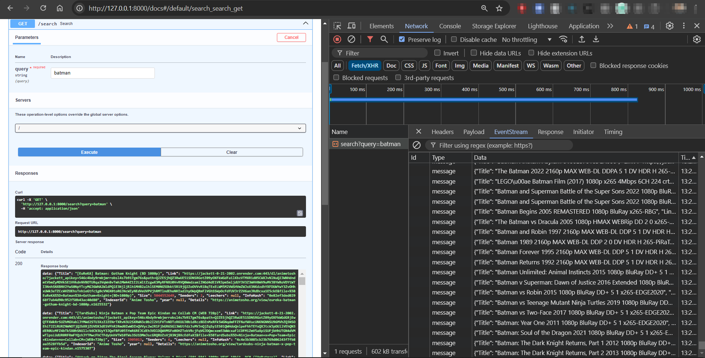

## Jackett Search API - Python: Streaming API for searching torrent trackers efficiently

This project provides a FastAPI-based API for searching torrent trackers using Jackett. It leverages asynchronous programming for efficient concurrent requests to multiple indexers. The API streams results in a JSON format, making it easy to integrate into various applications.

### Features

- **Concurrent Indexing:** Fetches results from multiple configured Jackett indexers simultaneously for faster search results.
- **Error Handling:** Gracefully handles errors from individual indexers to prevent crashes.
- **Streaming Responses:** Uses Server-Sent Events (SSE) to stream results as they become available, providing a real-time experience.
- **Caching:** Caches configured indexers for improved performance.
- **CORS Support:** Allows cross-origin requests for easier integration with front-end applications.

### Setup

#### 1. Prerequisites

- Python
- `pip` package manager
- A Jackett instance with API access enabled (e.g., [https://jackett.xyz/](https://jackett.xyz/))

#### 2. Install Dependencies

```bash
pip install -r requirements.txt
```

#### 3. Configure Environment Variables

- **JACKETT_API_URL:** The URL of your Jackett instance (e.g., `https://your-jackett-instance.com`)
- **API_KEY:** Your Jackett API key

#### 4. Run the API

To run the API, execute the following command from the root of the project:
```
uvicorn app.main:app --reload
```




### Contributing

Contributions are welcome! Please feel free to submit pull requests or open issues.

### License

This project is licensed under the [MIT License](LICENSE).

### Disclaimer

This project is for educational purposes and is not intended for illegal activities. Please respect the copyright and intellectual property rights of others. 
